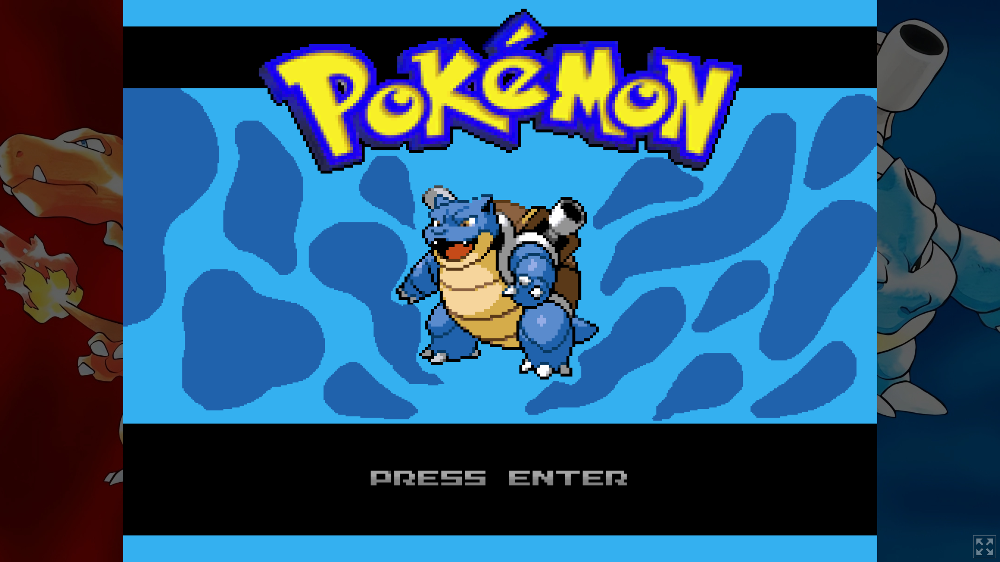

# Pokemon prototype game made with JavaScript + p5.js

Live demo : https://jslegend.itch.io/p5-pokemon-prototype

A prototype pokemon game that includes :

- camera
- scenes
- basic battle system
- basic animation player system
- player controller
- basic collision detection

Made with JavaScript and the p5.js creative coding library
by JSLegend.

Tutorial on how to build this (TBD)

I run a YouTube channel where I make long-form JS gamedev tutorials.
If you're interested you can take a look : https://youtube.com/@jslegenddev
